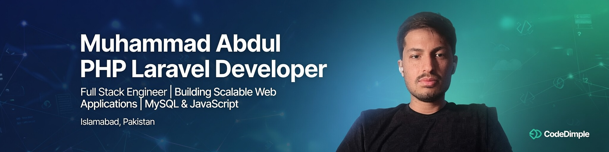

<!-- Banner Image -->

  

<!-- Title with Gradient Effect (using HTML for styling) -->
<h1 align="center">
  
</h1>

  <b>Full Stack Web Developer | Turning Ideas into Digital Reality</b>

  
  
  
  

---

## 🚀 About Me

I'm a passionate **Full Stack Web Developer** from **Punjab, Pakistan**. Over the last 5+ years, I've helped startups, agencies, and enterprises turn complex ideas into powerful digital products.

- 🔭 Currently working on **Laravel & Vue.js** projects
- 🌱 Learning **React Native** & **DevOps**
- 👯 Looking to collaborate on **Open Source** projects
- 💬 Ask me about **PHP, Laravel, MySQL, JavaScript**
- ⚡ Fun fact: I write code that writes code 🤖

---

## 🛠️ Tech Stack

  

---

## 📊 GitHub Stats

  
  

  

---

## 🏆 Featured Projects

| Project | Tech Stack | Links |
|---------|------------|-------|
| **School Management System** | Laravel, MySQL, Bootstrap | [🔗 Live Demo](https://partsfinder.ae/) |
| **Multi-Vendor E-commerce** | Laravel, Stripe, Vue.js | [🔗 GitHub](#) |
| **Library Management** | PHP, Laravel, jQuery | [🔗 GitHub](#) |
| **Real Estate Platform** | Laravel, Google Maps, Alpine.js | [🔗 GitHub](#) |
| **Analytics Dashboard** | Chart.js, Laravel API | [🔗 GitHub](#) |

---

## 💼 What I Offer

  <table>
    <tr>
      <td align="center">🌐</td>
      <td><b>Custom Web Development</b> Laravel, PHP, JavaScript</td>
      <td align="center">🛒</td>
      <td><b>E-commerce Solutions</b> Payment gateways, inventory, analytics</td>
    </tr>
    <tr>
      <td align="center">🗄️</td>
      <td><b>Database Design</b> Optimization & management</td>
      <td align="center">⚡</td>
      <td><b>API Development</b> RESTful APIs & integrations</td>
    </tr>
  </table>

---

## 📈 Activity Graph

  

---

## 📫 Let's Connect

  <b>I'm always open to discussing new projects, collaborations, or just tech in general!</b>

  📧 <b>Email:</b> abdulsoftwareengineer64@gmail.com 
  📞 <b>Phone:</b> +92 314 0699386 
  🌍 <b>Location:</b> Punjab, Pakistan (Remote / Worldwide)

  
  

---

  

  <i>“Code is poetry — I write clean, maintainable, and future-proof applications.”</i>

